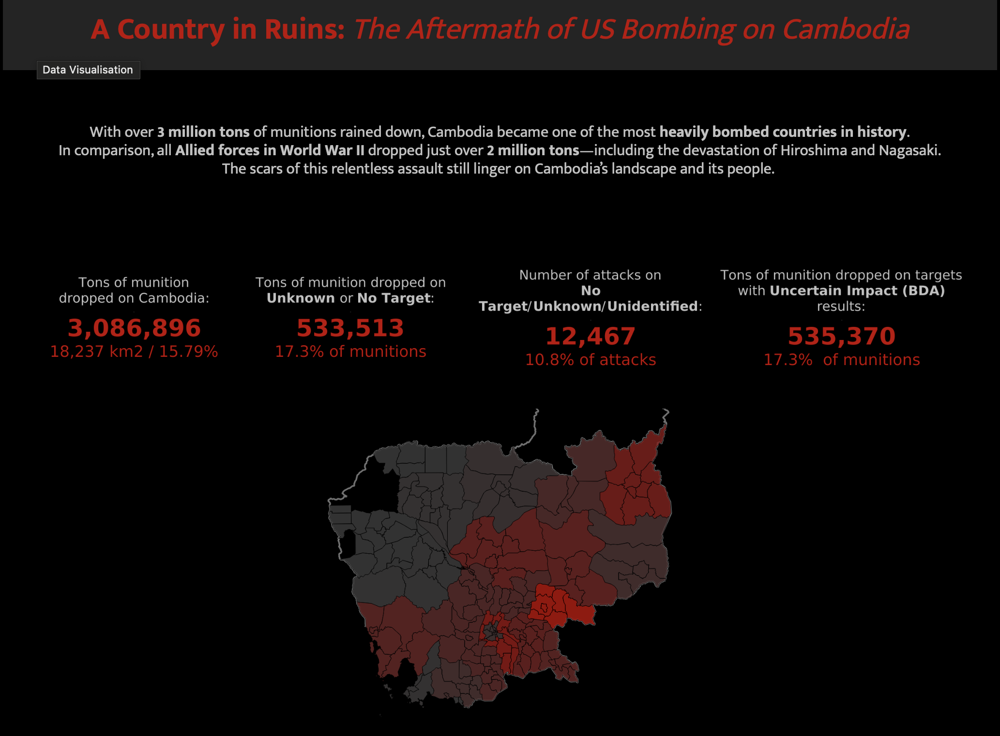
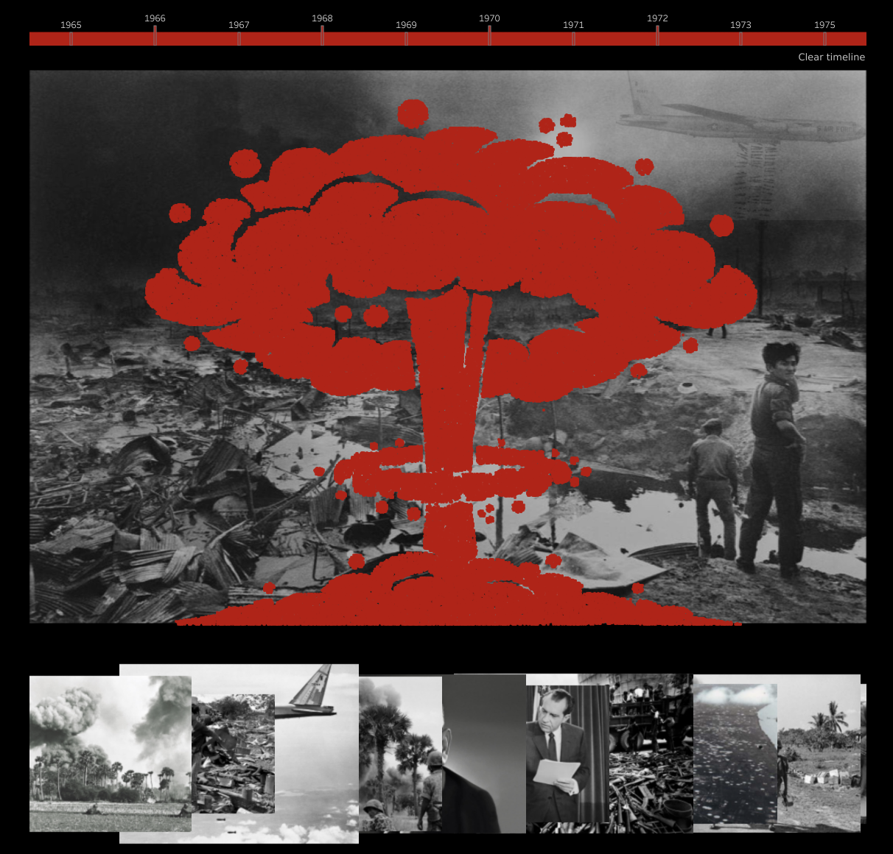

# Cambodia Bombing Analysis (1965-1975)

This repository contains an in-depth analysis of U.S. bombing data in Cambodia between 1965 and 1975. The project combines advanced geospatial and statistical analyses to provide insights into the bombing patterns, their intensity, and affected areas by province and district.

## Project Vision

This project aims to go beyond numbers and statistics. While the data provides insights into the bombings, the objective was to create a **storytelling experience** that captures the magnitude of the campaign and its impact.

> "I wanted users to experience the story not just through numbers, but through a thoughtful combination of **data-driven insights**, **evocative imagery**, and **custom visualisations** that bring the findings to life."

## Features

### 1. **Comprehensive Geospatial and Statistical Analysis**
- Explores bombing data by province and district, highlighting the scale and intensity of the U.S. bombing campaign.
- Includes metrics like **Load Tons**, **Bombed Area Percentage**, and **Total Bombed Area (km²)** for each administrative division.

### 2. **Custom Visualisations**
- A striking **explosion visualisation** created dynamically using munitions data, illustrating the campaign's intensity and devastation (see image below).
- An interactive **timeline** enables users to trace the progression of the bombing operations over the years.

### 3. **Interactive Filters**
- Users can filter for:
  - **No Target Attacks** (attacks recorded without confirmed targets).
  - **Uncertain Impact** to examine unverified outcomes, categorized as:
    - Not Available
    - Unobserved Outcome (RNO**)
    - Delayed Detonation or Observation Issues (RNO Dly BM/FU)
- These filters allow users to better understand the scope of unverified operations and gain unique insights into decision-making and assessment processes.

### 4. **Data-Driven Storytelling**
- The project bridges data and storytelling to present an impactful narrative, highlighting operational decisions and their consequences.
- Through dashboards and visuals, users can explore the broader context of the bombing campaign and its lasting impacts.

## Project Intention

This project demonstrates that only by digging deeply into data can we uncover the nuanced decisions behind major events, their wide-ranging impacts, and the stories of those involved. By bridging raw data with storytelling, the project creates a meaningful narrative that sheds light on historical decision-making and its consequences.

---

## Files and Resources

- **Jupyter Notebook**: Includes the code used for data cleaning, spatial analysis, and exporting files for Tableau.
- **Tableau Dashboard**: Interactive visualisation showcasing the bombing data, timelines, and filters for better user exploration. 
[Explore the Tableau Dashboard here](https://public.tableau.com/app/profile/stefania4501/viz/ACountryinRuinsTheAftermathoftheUSBombingonCambodia/Dashboard3?publish=yes)
- **Data Files**: Cleaned and aggregated data files for replication and further analysis.

---
